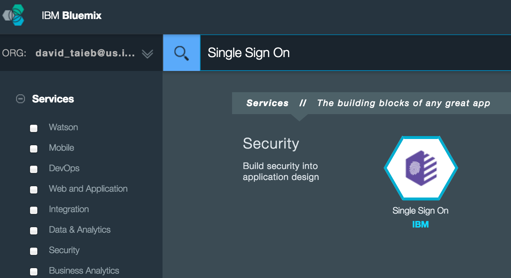
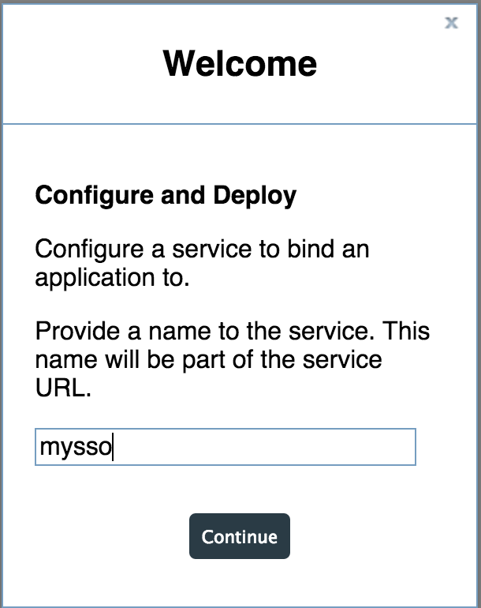
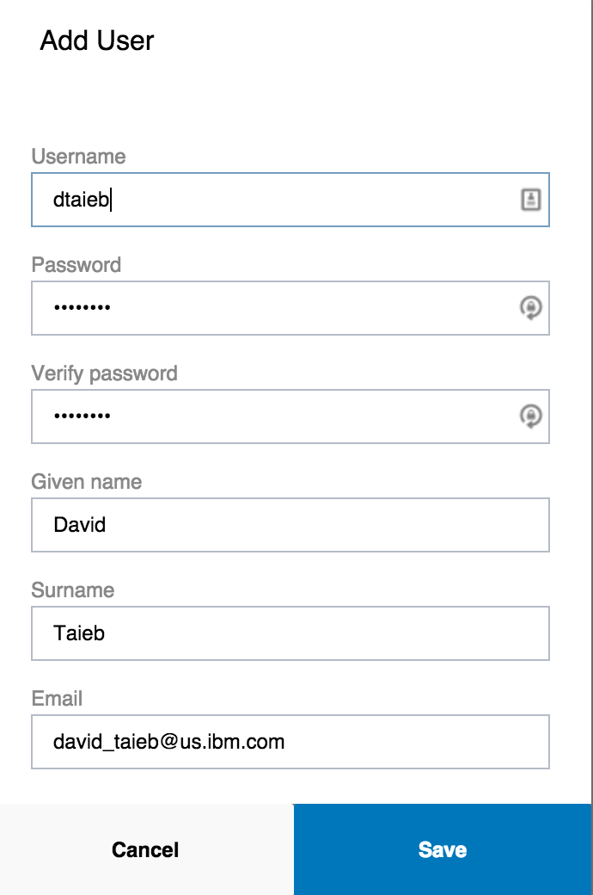

# Introduction
bluemix-helper-sso is a nodejs module library that makes it very easy to add authentication to your Bluemix application using the IBM Single Sign-On service. You can find more information on SSO Service [here](https://www.ng.bluemix.net/docs/#services/SingleSignOn/index.html#sso_gettingstarted).  
Note: Before using this library, please make sure that your application is written in nodejs and is using [expressjs](http://expressjs.com/) and [passportjs](http://passportjs.org/) framework.   

# Configuring SSO service for your Bluemix application  
Please follow the following steps to add and configure an SSO service to work with your Bluemix application:  
* From your space Dashboard, click on the "USE SERVICES OR APIS" tile (Note: it is important to do it from there as opposed to the dashboard of your application so that the service is created without being bound to an application, otherwise you won't be able to complete the service creation).  
* In the catalog search box, type "Single Sign On" and select the service

* Complete the configuration steps and click on the "Use" button.  
* You should see a Welcome screen asking your to provide a name   
* In the next page, you will need to add new Identity Source. SSO supports multiple providers like SAML Enterprise, LinkedIn, etc... As an example, we'll add a Cloud Directory provider and manually add users. Click on the "Cloud Directory" icon.  
* Click on the + button to add as many users as you'd like:   
* Click Save to complete the user creation  
* The next steps is to bind the SSO to your application and complete the Integration steps. From the Bluemix dashboard, click on your application to open its configuration page  
* Stop the application by clicking on the Stop button on the top right. (Note: it is required that the application is stopped before binding it to the SSO service)  
* Select "BIND A SERVICE OR API" tile  
* Select the SSO service and click on the ADD button. This will add the SSO service tile to the app dashboard.  
* Click on the SSO service tile and notice that there is now an extra tab on the top right called "Integrate". Click on this tab for further configuration.  
* In the Return-to URL box, enter the following url: `https://<your_app_route>/auth/sso/callback` where <your_app_route> is the bluemix route used by your application e.g. `https://myapp.mybluemix.net/auth/sso/callback`  
* You can leave the other values as is. Click Save to complete configuration of the SSO service  
* Go back to the application dashboard and click on the Start button to restart it.

This SSO Service configuration step is now complete. The next section will cover how to add authentication to the application code.

# Add authentication to your Bluemix node application
As mentioned before, [expressjs](http://expressjs.com/) and [passportjs](http://passportjs.org/) framework are expected to be used in your node application.  

The following example code shows demonstrates how the steps needed to easily add authentication to your Bluemix application:  
1. Create the app express object  
2. Use the [bluemix-helper-config](https://github.com/ibm-cds-labs/bluemix-helper-config) library to easily detect if SSO service is bound to your application   
3. Invoke the bluemix-helper-sso library using the express app object and an option object with the following parameters:  
  * ssoService: Json Object representing the SSO Service returned by the bluemix-helper-config library  
  * ssoServiceName: (alternative to ssoService) pass the name of the sso service that will be query by the bluemix-helper-sso library  
  * relaxedUrls: (Optional) Array of urls that will not be authenticated. e.g: /img will match any url starting with /img. Note: "/" is a special case. Because it's the root, it will only match the root url (as to avoid relaxing the entire app)

```javascript
var express = require('express');		//expressjs  
var bluemixHelperConfig = require('bluemix-helper-config'); //helper config to locate sso service  
var bluemixHelperSSO = require('bluemix-helper-sso'); //Helper SSO  
...
var app = express();  	
//Locate the sso service by using regular expression (The name doesn't have to match exactly)  
var ssoService = bluemixHelperConfig.vcapServices.getService( "sso" );  
if ( ssoService) {  
  //Add SSO authentication to the app
  bluemixHelperSSO(app, {
  	ssoService:ssoService,
  	relaxedUrls:[
		"/js", "/img", "/css", "/bower_components", "templates"
	]
  });
}
...  
```  

By default, bluemix-helper-sso is using an in-memory session store to manage to the session ids. Optionally, you can also configure it to use your own session store, by passing a configuration object in the sessionConfig field. The following code example shows how to use redis as the session store:  

```javascript
... 
var ssoService = bluemixHelperConfig.vcapServices.getService( "pipes-sso" );
if ( ssoService ){
	//Add SSO authentication to the app
	bluemixHelperSSO(app, {
		ssoService: ssoService,
		relaxedUrls:[
		    "/js", "/img", "/css", "/bower_components", "templates"
		],
		createSessionStore: function( session ){
		   //Use redis service to create the store if available
			var redisService = bluemixHelperConfig.vcapServices.getService("pipes-redis");
			if ( redisService ){
				var redisStore = require('connect-redis')(session);
				return new redisStore({
					host: redisService.credentials.hostname,
					port: redisService.credentials.port,
					pass: redisService.credentials.password
				});
			}
			return null;
		}
	});
}
...  
```  
